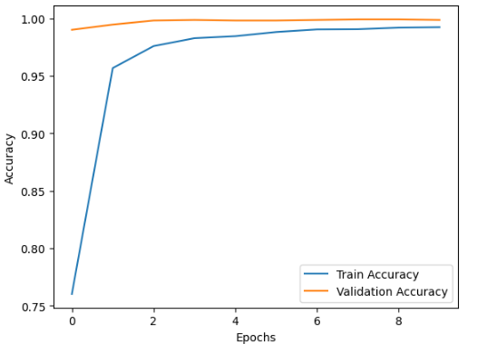
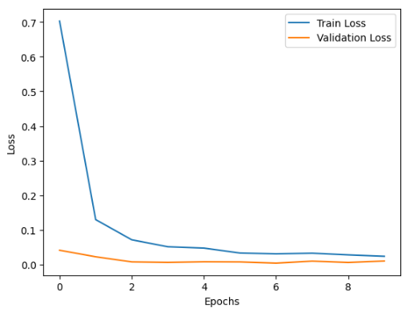

## Task 04: Hand Gesture Recognition

## Overview
This task involves implementing CNN (Convolution Neural Network).

The objective of this task is to create CNN model to classify different hand gestures from image.

## Model Results

## Dataset
The dataset is taken from kaggle website:
https://www.kaggle.com/datasets/gti-upm/leapgestrecog

## 💡 The benefit of this project:
1.✅Download the data
2.✅Rearrange data in sorted folders with renaming images
3.✅Manually split data into [Train, Test, Valid]
4.✅Data Preparation
5.✅Build CNN model
6.✅Evaluate the model
7.✅Classify images

## Technologies Used
- Python
- tensorflow
- Numpy
- Matplotlib
- splitfolders
- os
- shutil

## Algorithms

CNN model.

## Acknowledgments

Thanks to Prodigy InfoTech for providing this opportunity to work on such an exciting task